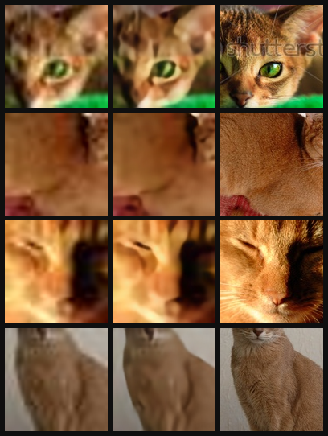
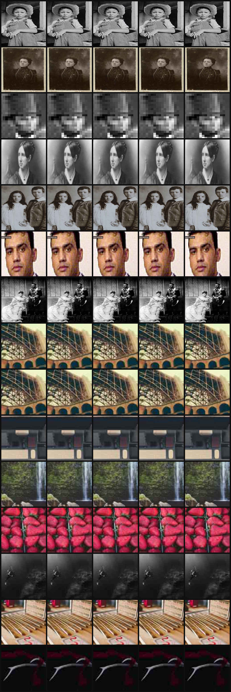
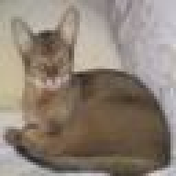
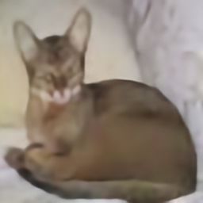
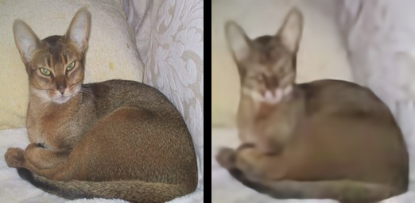

# Self-Supervised Image Super-Resolution

Single image super-resolution (4x) trained entirely from an ordinary folder of
photos — no premade LR/HR dataset is downloaded or used. Low-resolution training
inputs are synthesized on the fly from high-resolution source images using a
randomized degradation pipeline (blur → downsample → noise → JPEG compression).

Three models are trained and compared: a non-learned bicubic floor, an SRCNN
baseline (Dong et al.), and a final SRResNet-lite model (Ledig et al. backbone +
ESPCN PixelShuffle upsampling + EDSR's no-batch-norm finding + VDSR's
residual/delta prediction). A controlled ablation additionally compares training
SRResNet-lite on bicubic-only degradation vs. the full randomized pipeline, to
test whether realistic degradation actually improves generalization to real
low-quality photos.

Full reasoning behind every design decision — the degradation strategy,
architecture choices, loss function, and evaluation approach — is in
[`WRITEUP.md`](WRITEUP.md).

## Results

| Model                             | PSNR  | SSIM   |
|-----------------------------------|-------|--------|
| Bicubic (non-learned floor)       | 24.36 | 0.6366 |
| SRCNN (baseline)                  | 24.51 | 0.6452 |
| SRResNet-lite (bicubic-only)      | 24.63 | 0.6431 |
| SRResNet-lite (full degradation)  | 25.05 | 0.6634 |





### Qualitative single-image example

**1. Original HR photo (ground truth):**


**2. Degraded LR input (shown blown up for visibility — model actually sees it much smaller):**



**3. Model's predicted HR reconstruction:**



**4. Side-by-side comparison — original vs predicted:**



## Project structure
self-supervised-sr/
├── .gitignore
├── README.md
├── requirements.txt
├── WRITEUP.md
├── LICENSE
│
├── src/
│   ├── __init__.py
│   ├── data.py
│   ├── models.py
│   ├── train.py
│   ├── evaluate.py
│   └── utils.py
│
├── scripts/
│   ├── download_data.py
│   ├── train_srcnn.py
│   ├── train_srresnet_bicubic.py
│   ├── train_srresnet_full.py
│   └── run_eval.py
│
├── configs/
│   ├── bicubic.json
│   ├── srcnn.json
│   ├── srresnet_bicubic.json
│   └── srresnet_full.json
│
├── data/
│   ├── images/
│   │   └── .gitkeep
│   └── real_lowres/
│       └── .gitkeep
│
├── outputs/
│   └── .gitkeep
│
├── assets/
│   ├── snapshots/
│   │   └── .gitkeep
│   ├── comparison_table.md
│   └── real_photo_comparison.png
│
└── notebooks/
    └── colab_train_and_eval.ipynb
## Setup

```bash
git clone https://github.com/<you>/self-supervised-sr.git
cd self-supervised-sr
pip install -r requirements.txt
```

## Running it

**1. Download and prepare the HR image pool**
```bash
python scripts/download_data.py
```
This downloads Oxford-IIIT Pet, keeps only images at or above a minimum native
resolution (never upsamples a source image), and saves the filtered pool to
`data/images/`.

**2. (Optional) Add real low-quality photos for qualitative evaluation**
Drop 5–10 genuinely low-quality images (old photos, screenshots, compressed
downloads) into `data/real_lowres/`. These are never used in training — used
only for the qualitative, no-ground-truth comparison at evaluation time.

**3. Train each model**
```bash
python -m src.train --config configs/bicubic.json
python scripts/train_srcnn.py
python scripts/train_srresnet_bicubic.py
python scripts/train_srresnet_full.py
```
Each run writes to `outputs/<run_name>/`: checkpoints, per-epoch snapshot
images, and a training history log.

**4. Evaluate**
```bash
python scripts/run_eval.py
```
Produces `outputs/eval/comparison_table.md` (PSNR/SSIM for all four models on
the held-out synthetic test split) and `outputs/eval/real_photo_comparison.png`
(all four models run side by side on the real low-quality photo set).

## Key design decisions (short version — full reasoning in WRITEUP.md)

- **No premade dataset.** LR images are synthesized from HR photos on the fly:
  blur → bicubic downsample (4x) → noise → JPEG re-compression, with every
  parameter randomized per sample.
- **Why not just bicubic downsampling?** A model trained on bicubic-only
  degradation overfits to "undo bicubic resizing" specifically and generalizes
  poorly to real low-quality images. Tested directly via a controlled ablation
  (`srresnet_bicubic.json` vs. `srresnet_full.json` — identical architecture
  and loss, differing only in degradation strength).
- **Data split at the file level**, before any patch cropping, using a
  deterministic filename hash — guarantees no patch-level leakage between
  train/val/test.
- **Architecture**: SRResNet-lite combines SRResNet's residual-block backbone,
  ESPCN's PixelShuffle upsampling (staged in sequential 2x steps), EDSR's
  no-batch-norm finding, and VDSR's residual/delta prediction — each idea
  attributed to one specific paper.
- **Loss**: L1, chosen over MSE because MSE's quadratic penalty biases toward
  blurry "safe average" predictions on this ill-posed problem.
- **Not implemented (by design)**: adversarial/perceptual loss (SRGAN-style) —
  see WRITEUP.md Section 2.3 for the reasoning.

## Demo & Technical Walkthrough
[Watch the video](https://youtu.be/4WAF-5uhfGE)