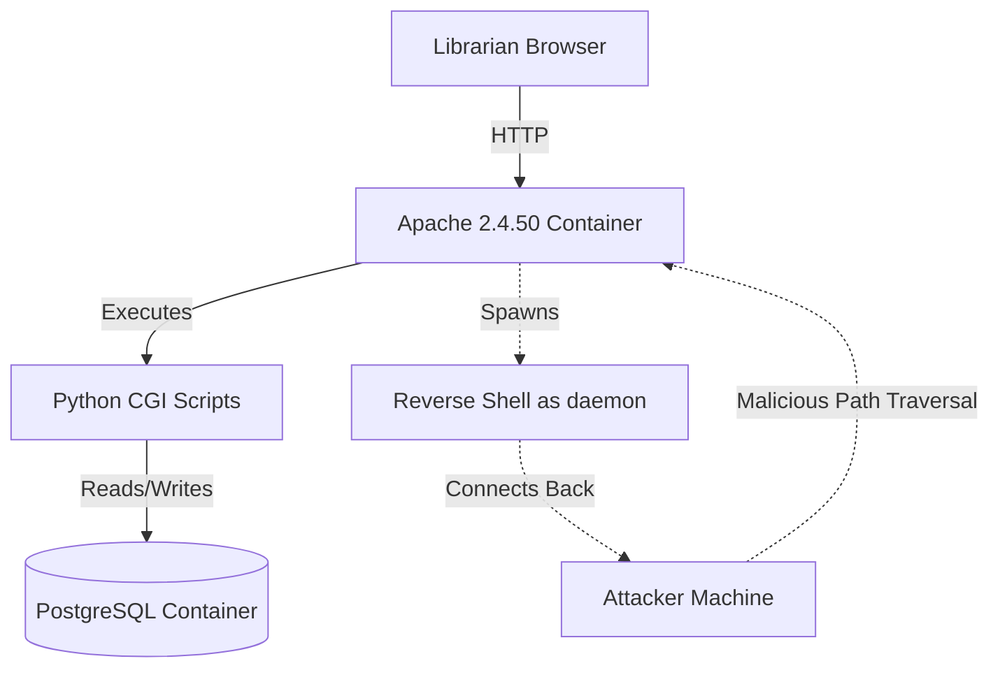

# System Architecture

## Overview
The Worm Library operates on a completely containerized architecture to ensure isolation. 

## Component Breakdown
1. **Client:** Librarian accessing the system via a standard web browser on the local network.
2. **Web Server:** Docker container running Apache 2.4.50. Handles HTTP requests and executes Python CGI scripts.
3. **Database:** Docker container running PostgreSQL. Stores library inventory and audit logs.
4. **Attacker:** External machine sending malicious HTTP requests to exploit CVE-2021-42013.

## Architecture Diagram

